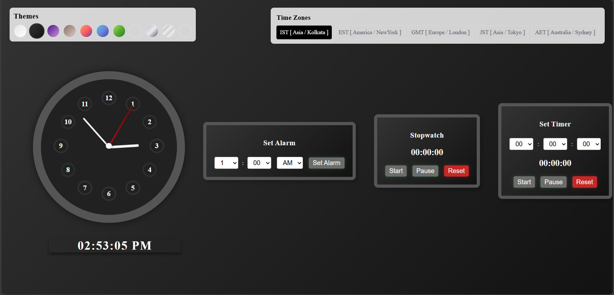

# Analog Clock with Alarm & Stopwatch  

A stylish **Analog & Digital Clock** with customizable themes, time zones, and built-in **alarm, stopwatch, and timer** features.  

## 🚀 Features  
✔ **Analog & Digital Clock** – Displays time dynamically  
✔ **Theme Customization** – Multiple themes (dark, neon, wood, etc.)  
✔ **Time Zone Support** – Change clock timezone easily  
✔ **Alarm Functionality** – Set & cancel alarms  
✔ **Stopwatch & Timer** – Track time with simple controls  
✔ **Mobile Responsive** – Works smoothly on all screen sizes  

## 🛠 Technologies Used  
- **HTML, CSS, JavaScript**  

## 📷 Preview  
 *(Upload a screenshot in your repo & update the link)*  

## 🔥 Live Demo  
[View on GitHub Pages]( https://thaksen-karote.github.io/analog-clock/) *(Update this after hosting)*  

## 📦 Installation  
1. Clone the repository:  
   ```sh
   git clone https://github.com/YOUR_USERNAME/analog-clock.git
